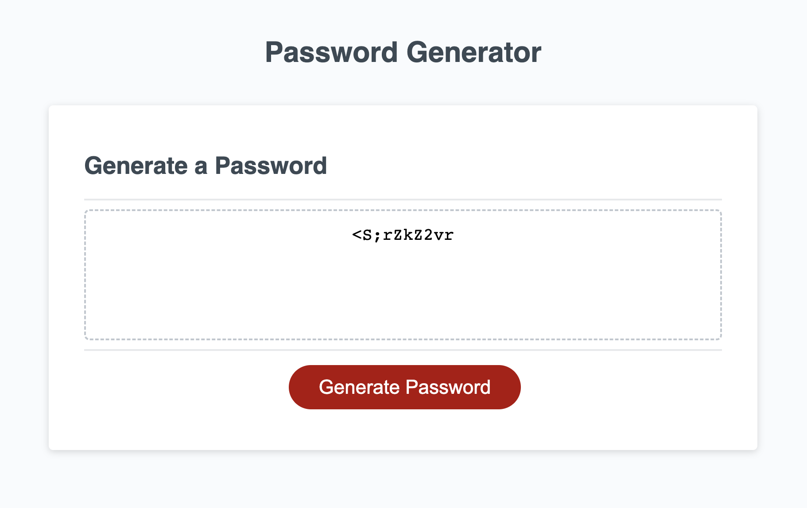

# 03-JavaScript-Password-Generator
Website showcasing a **random password generator** that outputs passwords based on a set of criteria with options selected by the user.

  
 
# Password Generator Criteria
A random password is generated based on the following questions 
 * Input a password length between 8 and 128 characters  
 * Click OK if you would like the password to contain lowercase  
 * Click OK if you would like the password to contain uppercase  
 * Click OK if you would like the password to contain numbers  
 * Click OK if you would like the password to contain special characters  
 * Note: at least one of the following options must be selected (lowercase, uppercase, numbers or special characters)  

# Website Link

 Link to the deployed site:
 [Password Generator](https://jvn101.github.io/03-JavaScript-Password-Generator/)

***
### Contact us
Contact our developer for any questions  
<JVN101@software.com>

